# Payanam (பயணம்)

Last Updated: 2026-09-14

> **Your Progress, Your Privacy** — Local-first life dimension manager for Android + Desktop

[](LICENSE)
[](LICENSE)

[](https://github.com/Aravinth-Earth/Payanam/releases)
[](https://github.com/Aravinth-Earth/Payanam/releases)
[](https://github.com/Aravinth-Earth/Payanam/releases)

Payanam is a privacy-first life dimension manager — tasks, habits, time tracking, journal, and insights across the dimensions of life you define. All data stays on your device. No cloud, no accounts, no tracking, no telemetry — and no network call ever carries your data. The one clearly-flagged exception that can send your data is the BYOK AI assistant, which is off unless you set it up yourself (an optional update check also talks to GitHub, but it sends none of your data; see [Privacy & network](#privacy--network)).

See [VISION.md](docs/VISION.md) for philosophy and roadmap.

---

## Screenshots

**English (EN)**

| | |
|---|---|
| 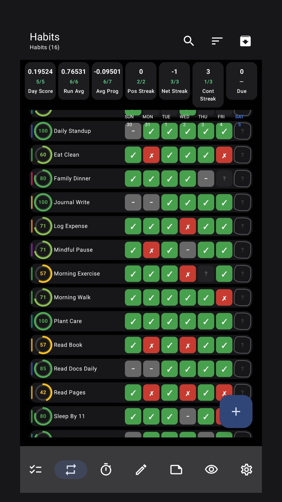 | 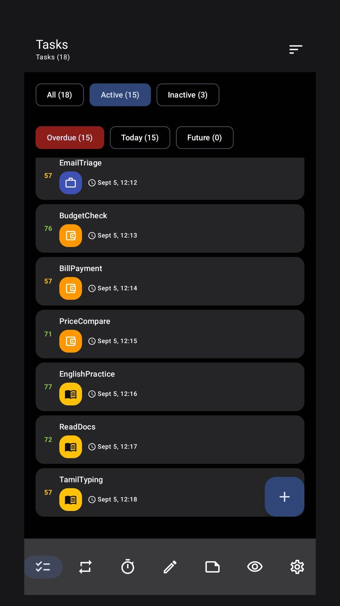 |
| 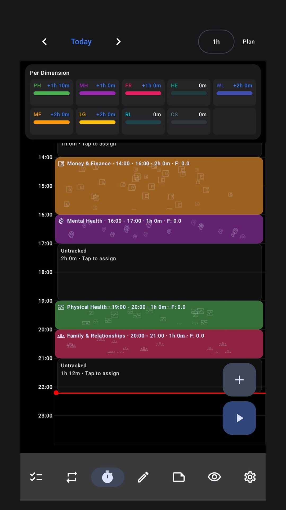 | 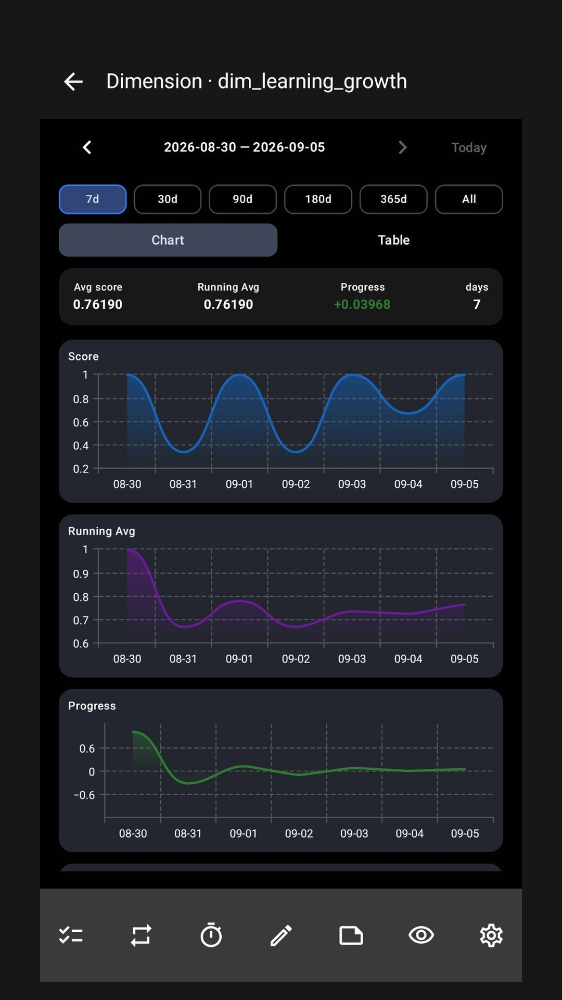 |
| 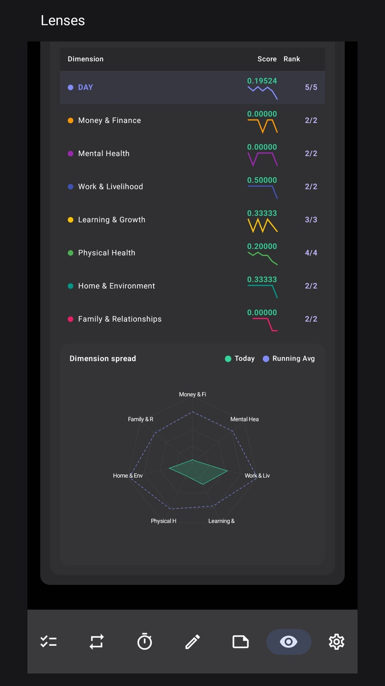 | 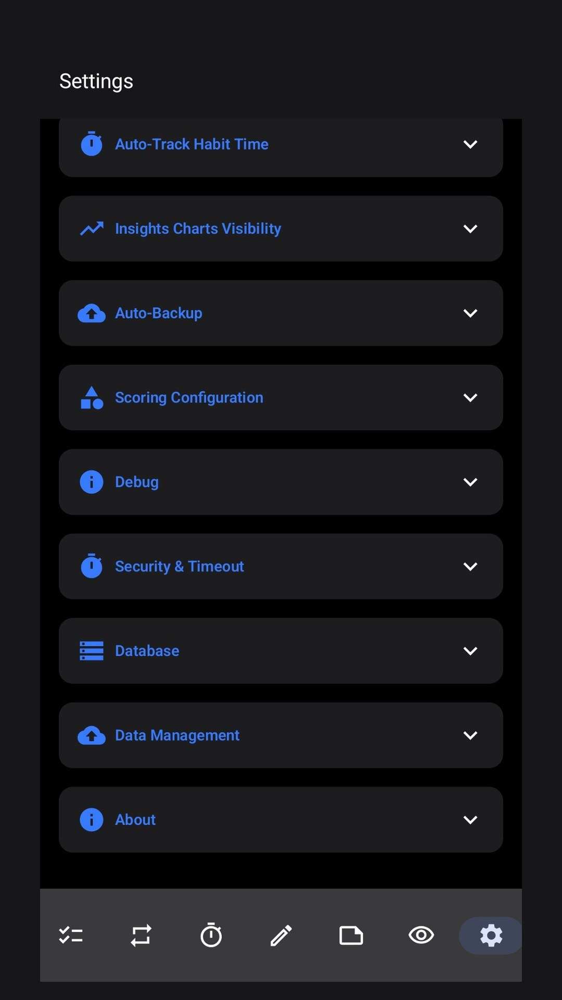 |

**Tamil (தமிழ்)**

| | |
|---|---|
| 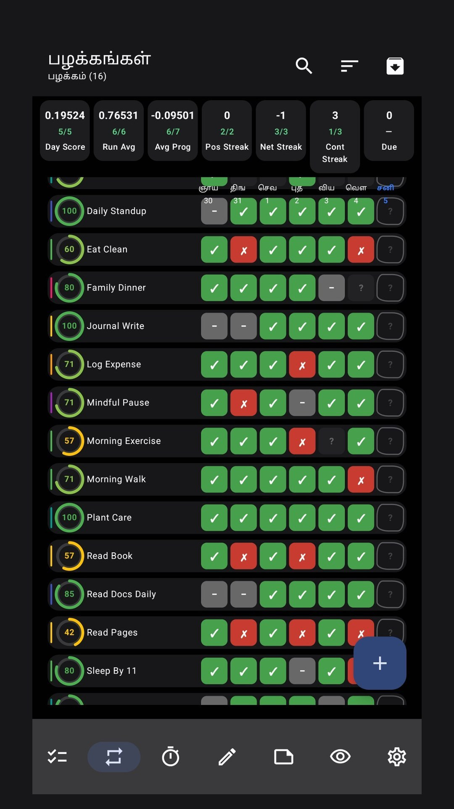 | 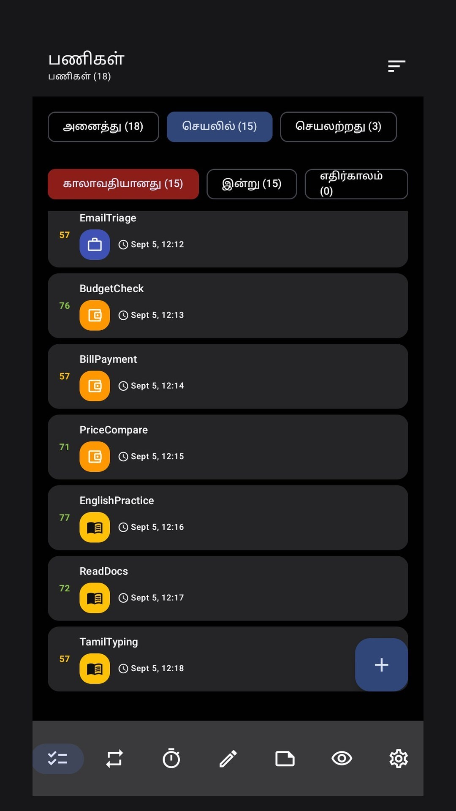 |
| 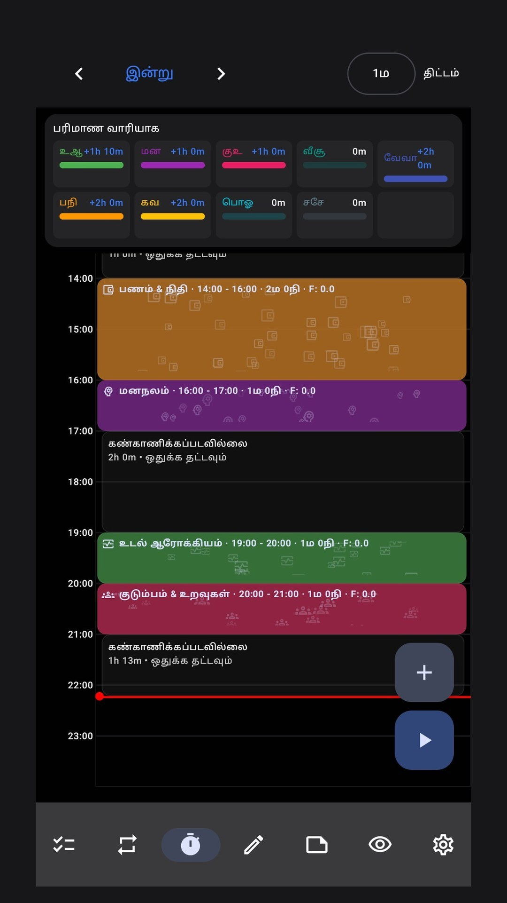 | 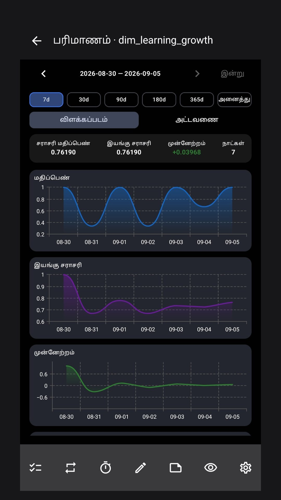 |
| 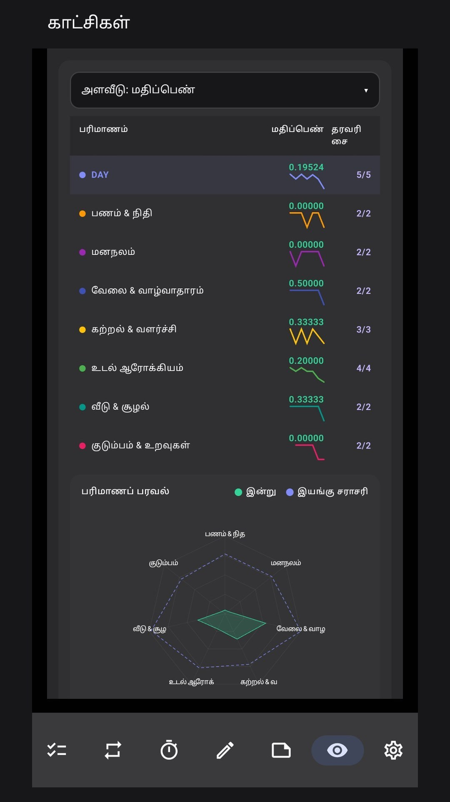 | 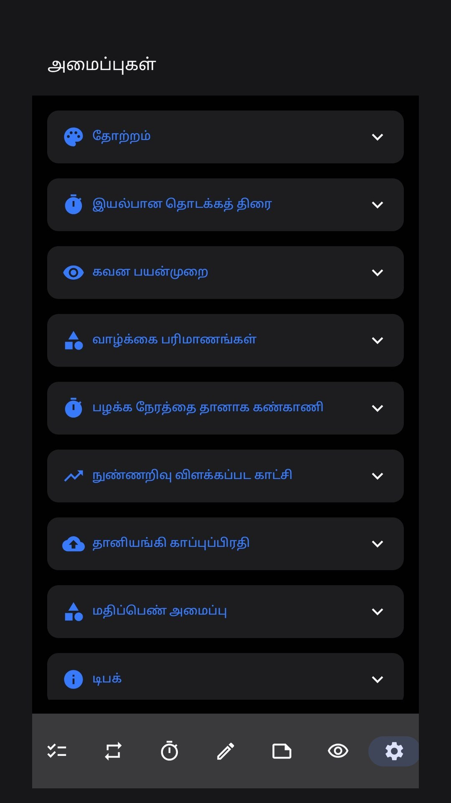 |

---

## Quick Start

```bash
# Build debug APK (requires Java 17 + Android SDK 35)
./gradlew assembleDebug
```

See [INSTALL.md](INSTALL.md) for sideload and verification steps.
See [docs/CONTRIBUTING.md](docs/CONTRIBUTING.md) for development setup and PR workflow.
See [CHANGELOG.md](CHANGELOG.md) for what's new.

---

## Features

| Status | Feature |
|--------|---------|
| ✅ | Tasks — Full CRUD with priority scoring (9-factor weighted formula), templates, recurring, tags, reminders |
| ✅ | Habits — 8 life dimensions, binary + numeric types, score carry-forward |
| ✅ | Time Tracking — Per-dimension sessions with timeline view |
| ✅ | Insights — Charts, dimension scoring dashboard, daily stats |
| ✅ | Journal — Daily notes with dimension tagging |
| ✅ | Tamil (தமிழ்) — Full string parity in `values-ta/` |
| ✅ | Desktop foundation — Compose Desktop with Windows EXE/MSI |
| 🧪 | Optional AI Assistance (BYOK) — ask your data in plain language using your own model provider key; off by default, and the app stays fully offline without it |
| 🔄 | Export / Import — Auto-backup + manual export/import with passphrase |
| ⏭️ | Cross-device sync (planned) |

---

## Privacy & network

Payanam is offline by design. It has no servers, no accounts, no analytics, and no telemetry: unless you explicitly enable the one optional feature below, no data about you or your usage ever leaves your device, and the app is fully functional offline.

**AI Assistance — optional, BYOK (bring your own key).** A chat screen (Lenses → AI Assistance) where you connect your own model provider key and ask questions about your tracked data. The rules:

- **Opt-in and off by default.** If you never open it and add a key, it never runs and no network call is ever made on its behalf.
- **You bring your own key** — your key is stored only inside the app's encrypted database, never in plain text.
- **Minimum data only.** When — and only when — you ask a question, your question plus the read-only SQL result rows needed to answer it are sent to the model provider you chose; the answer is generated there. Your database is never uploaded.
- **AI answers are statistical.** They can be wrong, and a model's reading is not human or professional judgement — verify the numbers, treat suggestions as hints.
- **Fully reversible.** Remove the key at any time and the feature is off again.
- **Third-party service.** The optional connection uses OpenCode Zen. Your key and your usage are governed by [OpenCode's Terms of Service](https://opencode.ai/legal/terms-of-service); Payanam is not affiliated with OpenCode.

---

## Tech Stack

| Layer | Choice |
|-------|--------|
| **Language** | Kotlin 2.0 |
| **UI** | Jetpack Compose + Material3 |
| **Database** | Room (SQLite, local-only) |
| **DI** | Hilt (Dagger) |
| **Architecture** | Multi-module, MVVM + Repository |
| **Desktop** | Compose Multiplatform |
| **Min SDK** | 28 (Android 9) |
| **Target SDK** | 35 |

---

## Project Structure

```
payanam/
├── app/                    # Android app (UI, ViewModels, DI)
├── desktop/                # Compose Desktop foundation
├── core/
│   ├── shared/             # Cross-platform contracts (Android + Desktop)
│   ├── domain/             # Domain models, repository interfaces
│   ├── database/           # Room entities, DAOs, migrations, repositories
│   ├── scoring/            # Task priority scoring engine
│   └── common/             # Shared utilities, logging, sanitizer
├── build-tools/            # Build automation scripts (PowerShell)
├── config/                 # Detekt, Spotless quality config
├── gradle/                 # Gradle wrapper + version catalog
└── docs/                   # Vision, contributing guide, DB architecture
```

---

## Build

```bash
# Debug APK
./gradlew assembleDebug

# Release APK (minified)
./gradlew assembleRelease

# Unit tests + coverage
./gradlew test coverageCheck

# Static analysis
./gradlew preCommitCheck
```

Windows users can also use `.\build-tools\scripts\build-android.ps1` for the full pipeline (preflight checks, device install, smoke tests).

---

## Credits

Inspiration from [uHabits](https://github.com/iSoron/uhabits), [SATT](https://github.com/Razeeman/Android-SimpleTimeTracker), and [Google Stitch](https://stitch.google.com).  
Third-party libraries: AndroidX, Kotlin & kotlinx (Coroutines, Serialization), Jetpack Compose + Material3, Hilt (Dagger), Room, [SQLCipher](https://www.zetetic.net/sqlcipher/) (database encryption), [Vico Charts](https://github.com/patrykandpatrick/vico), Timber, WorkManager.  
Quality tooling: [detekt](https://detekt.dev), [Spotless](https://github.com/diffplug/spotless) + [ktlint](https://ktlint.github.io), JUnit, [Robolectric](https://robolectric.org), [Mockito](https://site.mockito.org), [Truth](https://truth.dev), Espresso.  
Optional AI gateway: [OpenCode Zen](https://opencode.ai/zen) — the BYOK provider the optional AI Assistance feature talks to. Payanam is not affiliated with OpenCode.

---

## License

[AGPL-3.0](LICENSE) — All modifications must be shared under the same terms.
