# Payanam (பயணம்)

Last Updated: 2026-10-27

> **Your Progress, Your Privacy** — Local-first life dimension manager for Android + Desktop

[](LICENSE)
[](LICENSE)

[](https://github.com/Aravinth-Earth/Payanam/releases)

Payanam is a privacy-first life dimension manager — tasks, habits, time tracking, journal, and insights across the dimensions of life you define. All data stays on your device. No cloud, no accounts, no tracking, no telemetry — and no network call ever carries your data. The only network traffic the app can generate is an optional update check that contacts GitHub and sends nothing but the app's version code, and, on Android only and only when you accept an update, the download of a GitHub release asset; build metadata is not user data, and nothing about you or your usage is ever sent.

**F-Droid build.** A build packaged for F-Droid makes no update call: the store client owns updates for those installs, so the app's own updater is disabled and it never downloads or installs an APK for itself.

**Published releases.** A release ships an Android APK and a Linux `.deb`, both built in `release` mode — a `debug`-type build is a development build and is never published. See [INSTALL.md](INSTALL.md) for the install and checksum-verification steps.

See [VISION.md](docs/VISION.md) for philosophy and roadmap.

---

## Screenshots

**English (EN)**

| | |
|---|---|
| 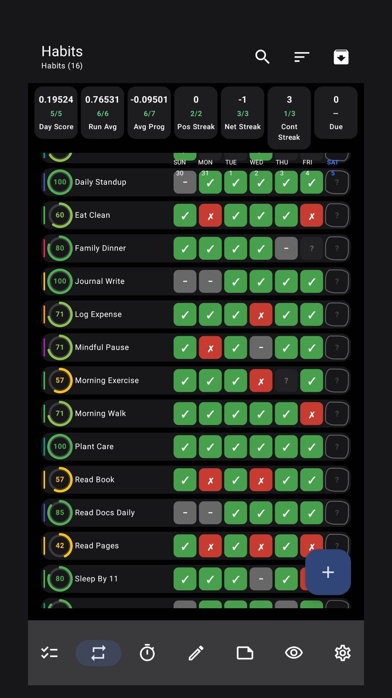 | 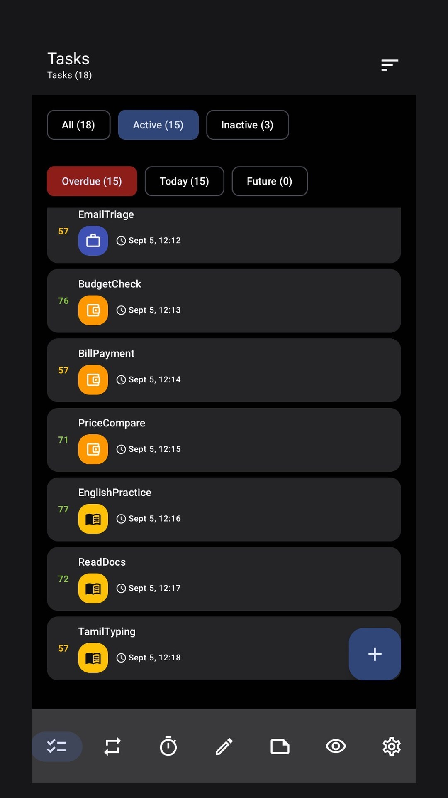 |
| 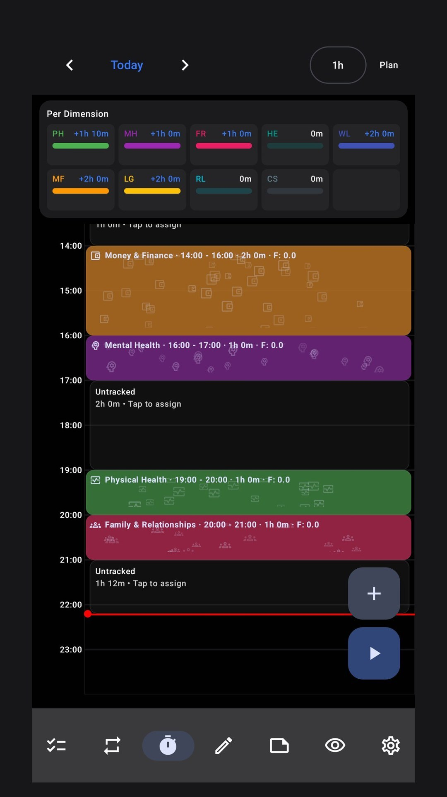 | 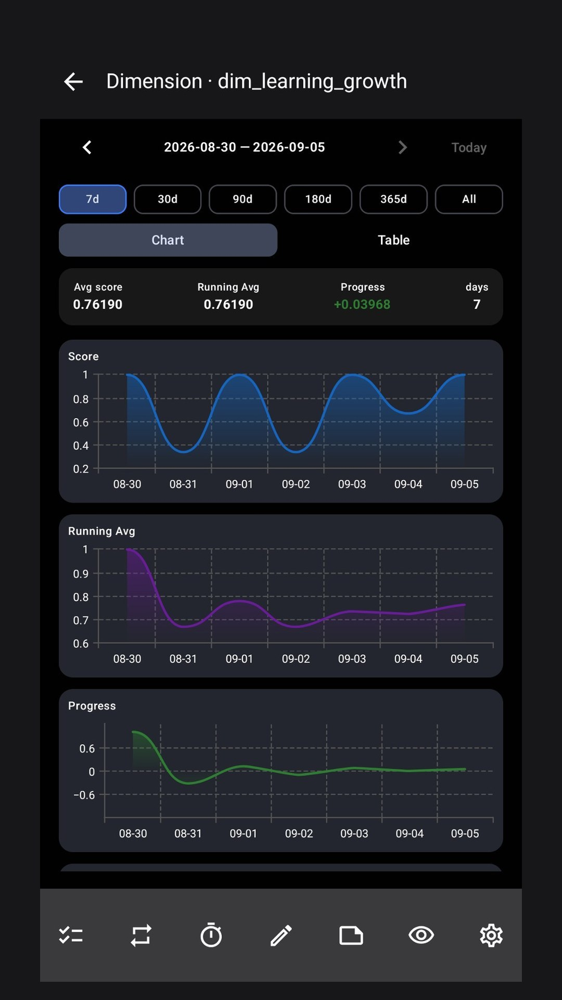 |
| 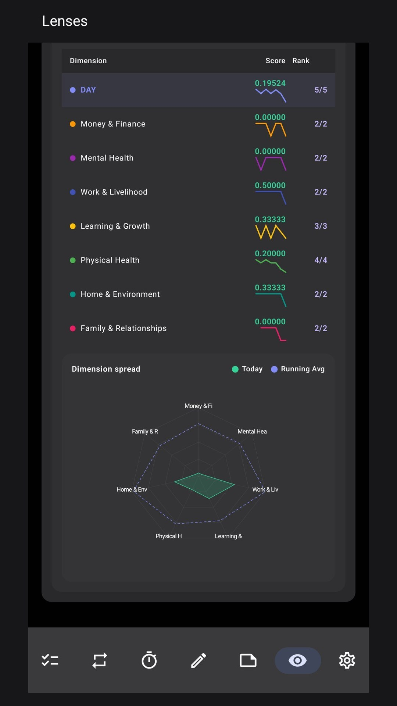 | 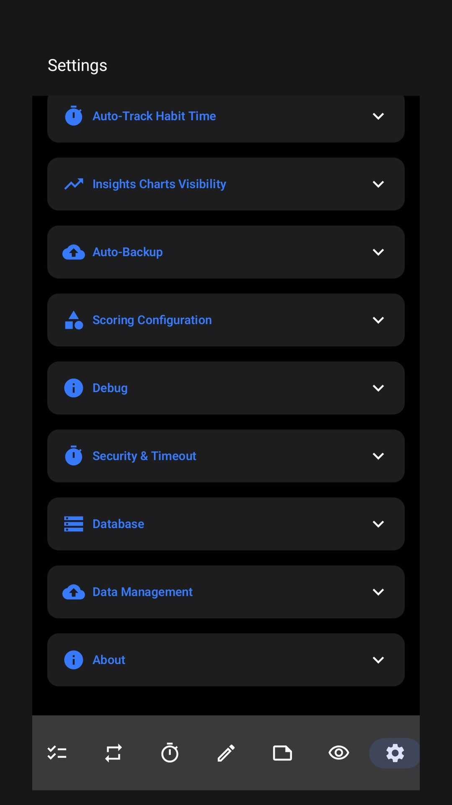 |

**Tamil (தமிழ்)**

| | |
|---|---|
| 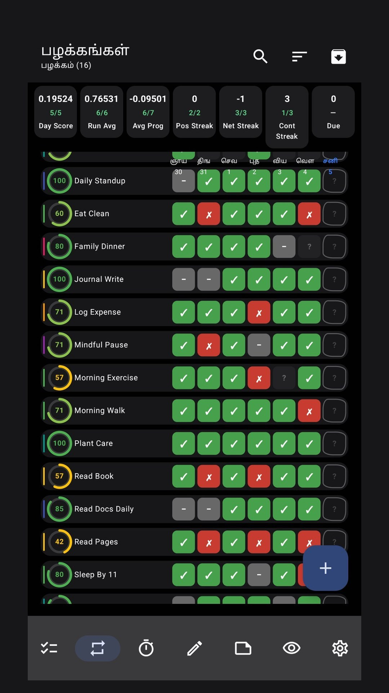 | 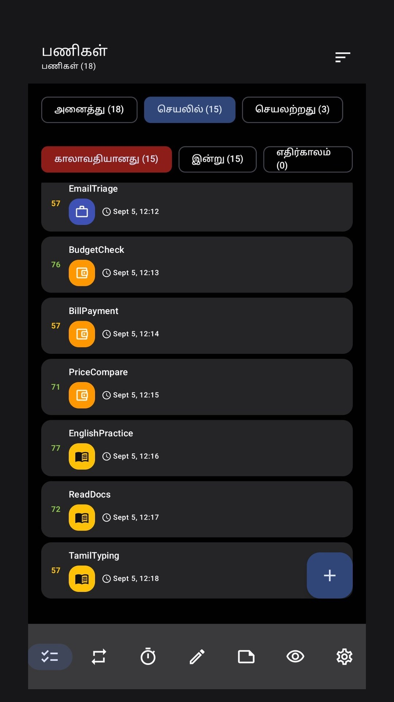 |
| 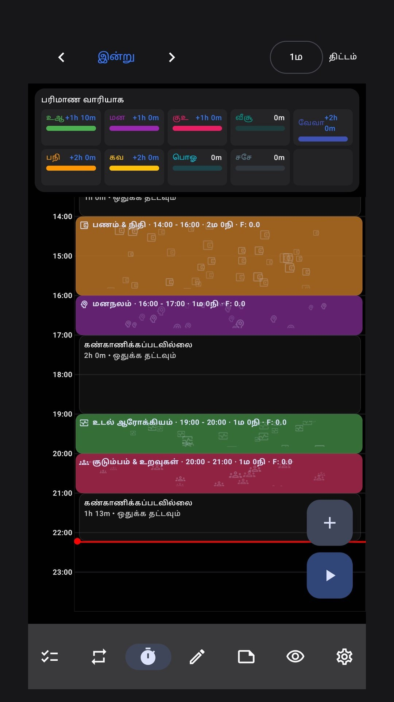 | 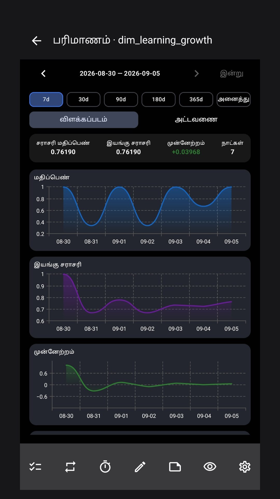 |
| 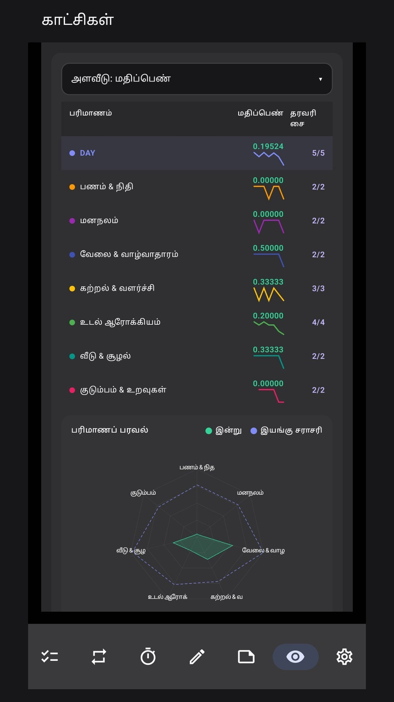 | 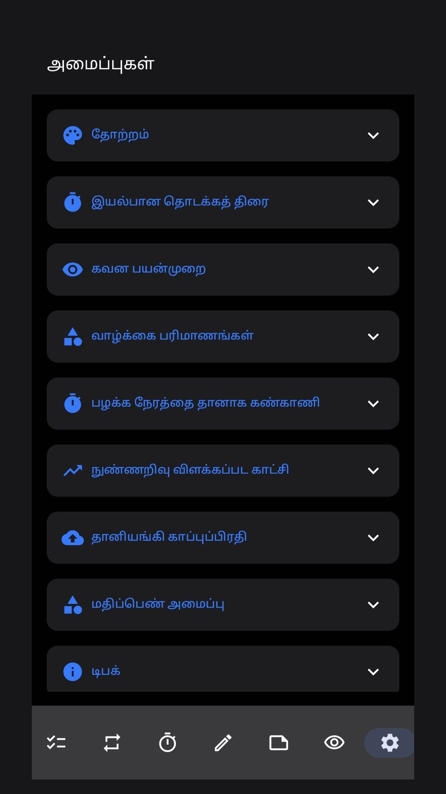 |

---

## Quick Start

```bash
# Build debug APK (requires Java 17 + Android SDK 35)
./gradlew assembleDebug
```

See [INSTALL.md](INSTALL.md) for sideload and verification steps.
See [docs/CONTRIBUTING.md](docs/CONTRIBUTING.md) for development setup and PR workflow.
## What's new

This project keeps one release-notes entry per version in [CHANGELOG.md](CHANGELOG.md), shared by every platform.

---

## Features

| Status | Feature |
|--------|---------|
| ✅ | Tasks — Full CRUD with priority scoring (9-factor weighted formula), templates, recurring, tags, reminders |
| ✅ | Habits — 8 life dimensions, binary + numeric types, score carry-forward |
| ✅ | Time Tracking — Per-dimension sessions with timeline view |
| ✅ | Insights — Charts, dimension scoring dashboard, daily stats |
| ✅ | Journal — Daily notes with dimension tagging |
| ✅ | Tamil (தமிழ்) — Full string parity in `values-ta/` |
| ✅ | Desktop foundation — Compose Desktop with Windows EXE/MSI |
| 🔄 | Export / Import — Auto-backup + manual export/import with passphrase |
| ⏭️ | Cross-device sync (planned) |

---

## Privacy & network

Payanam is offline by design. It has no servers, no accounts, no analytics, and no telemetry: no data about you or your usage ever leaves your device, and the app is fully functional offline.

**Local session logs.** Both the Android and desktop builds keep a session log on your device recording app errors, navigation and diagnostics — that log is what makes a bug report actionable, and it also records that a passphrase reset was attempted. It never leaves your device, it rotates automatically (the desktop keeps the 20 most recent sessions, Android keeps 9), and credentials, file paths and note/journal content are redacted before they are written. On desktop, debug-level entries follow the build: a debug build logs them from start-up and a release build does not, the in-app Debug logging switch changes that at runtime, and launching with the environment variable overrides the build's default for that session (`export PAYANAM_DEBUG_LOGGING=true` on Linux/macOS; `$env:PAYANAM_DEBUG_LOGGING = "true"` in Windows PowerShell).

**Fail-closed security state.** If the desktop app cannot read its stored passphrase configuration, it refuses to start rather than continuing, because it cannot tell a fresh install apart from a damaged one. The recovery it offers clears only the passphrase and its lockout state — your tasks, journal, notes and settings are not touched.

---

## Tech Stack

| Layer | Choice |
|-------|--------|
| **Language** | Kotlin 2.0 |
| **UI** | Jetpack Compose + Material3 |
| **Database** | Room (SQLite, local-only) |
| **DI** | Hilt (Dagger) |
| **Architecture** | Multi-module, MVVM + Repository |
| **Desktop** | Compose Multiplatform |
| **Min SDK** | 28 (Android 9) |
| **Target SDK** | 35 |

---

## Project Structure

```
payanam/
├── app/                    # Android app (UI, ViewModels, DI)
├── desktop/                # Compose Desktop foundation
├── core/
│   ├── shared/             # Cross-platform contracts (Android + Desktop)
│   ├── domain/             # Domain models, repository interfaces
│   ├── database/           # Room entities, DAOs, migrations, repositories
│   ├── scoring/            # Task priority scoring engine
│   └── common/             # Shared utilities, logging, sanitizer
├── build-tools/            # Build automation scripts (PowerShell)
├── config/                 # Detekt, Spotless quality config
├── gradle/                 # Gradle wrapper + version catalog
└── docs/                   # Vision, contributing guide, DB architecture
```

---

## Build

```bash
# Debug APK
./gradlew assembleDebug

# Release APK (minified)
./gradlew assembleRelease

# Unit tests + coverage
./gradlew test coverageCheck

# Static analysis
./gradlew preCommitCheck
```

Windows users can also use `.\build-tools\scripts\build-android.ps1` for the full pipeline (preflight checks, device install, smoke tests).

---

## Credits

Inspiration from [uHabits](https://github.com/iSoron/uhabits), [SATT](https://github.com/Razeeman/Android-SimpleTimeTracker), and [Google Stitch](https://stitch.google.com).

Payanam is built on other people's work. Every library it ships with, and every tool it builds and tests with, is named below with the version this release uses. The same list is inside the app under **Settings → About**, where each row opens that project's own page.

**Android runtime** — AndroidX Core KTX 1.18.0 · AndroidX Activity Compose 1.13.0 · AndroidX Lifecycle 2.10.0 · AndroidX Navigation Compose 2.9.7 · [Jetpack Compose](https://developer.android.com/jetpack/compose) (BOM 2026.02.01) with Compose Material 3 1.3.1 · [Hilt](https://dagger.dev/hilt/) 2.59.2 and Hilt Navigation Compose 1.3.0 · [Room](https://developer.android.com/training/data-storage/room) 2.7.2 on AndroidX SQLite 2.7.0 · [SQLCipher for Android](https://www.zetetic.net/sqlcipher/) 4.17.0 (database encryption) · [Kotlin Coroutines](https://github.com/Kotlin/kotlinx.coroutines) 1.10.2 · [Kotlin Serialization](https://github.com/Kotlin/kotlinx.serialization) 1.9.0 · AndroidX DataStore 1.2.1 · AndroidX WorkManager 2.11.1 · AndroidX Biometric 1.1.0 · [Vico](https://github.com/patrykandpatrick/vico) 3.1.0 · [Timber](https://github.com/JakeWharton/timber) 5.0.1.

**Desktop runtime** — [Compose Multiplatform](https://github.com/JetBrains/compose-multiplatform) 1.10.2 · AndroidX Navigation Compose (multiplatform) 2.9.2 · Kotlin Coroutines (Swing) 1.10.2 · [SQLite JDBC](https://github.com/xerial/sqlite-jdbc) 3.50.3.0 · [SQLCipher Multiplatform JDBC](https://github.com/s0d3s/sqlcipher-multiplatform-jdbc) 0.2.13 (MIT).

**Build and packaging** — Android Gradle Plugin 9.3.0 · [Kotlin](https://kotlinlang.org) 2.3.20 · [KSP](https://github.com/google/ksp) 2.3.10 · Hilt compiler 2.59.2 · Room compiler 2.7.2.

**Tests and quality tooling** — JUnit 4.13.2 · AndroidX Test (core 1.7.0, ext-junit 1.3.0) · [Espresso](https://developer.android.com/training/testing/espresso) 3.7.0 · [Robolectric](https://robolectric.org) 4.16.1 · [Mockito](https://site.mockito.org) 5.23.0 with mockito-kotlin 5.4.0 · [Truth](https://truth.dev) 1.4.5 · Kotlin Coroutines Test 1.10.2 · Room testing 2.7.2 · Compose UI Test (BOM 2026.02.01) · [org.json](https://github.com/stleary/JSON-java) 20240303 (public domain) · [detekt](https://detekt.dev) 1.23.8 · [Spotless](https://github.com/diffplug/spotless) 8.4.0 · [ktlint](https://ktlint.github.io) 1.8.0.

Versions mirror [`gradle/libs.versions.toml`](gradle/libs.versions.toml), and the licences are the ones each project publishes.

---

## License

[AGPL-3.0](LICENSE) — All modifications must be shared under the same terms.
