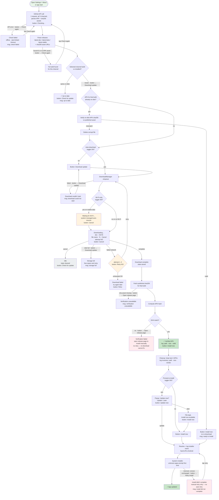
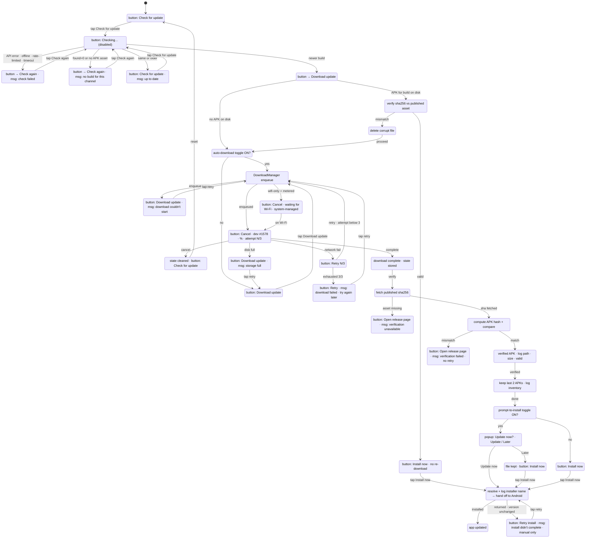

# Channel Auto-Update — Flow & State Machine

> Last Updated: 2026-08-13
> Diagram-first: review this diagram before any code change to the update flow.
> Convention: node = logic state; node text carries the UI button/message it shows; edge labels marked `button →` show where the button text changes.

## 1. Combined flow — single live-check on open



## 2. Channel mapping

| Branch | Channel | Cadence | Tag | Prerelease |
|--------|---------|---------|-----|-----------|
| `feature/*` | dev | 10+/day | `latest-dev` | yes |
| `dev` | beta | 2/week | `latest-beta` | yes |
| `main` | stable | 2/month | `latest-stable` | no |

Rolling releases: one release per channel, always the newest. Old releases are deleted on publish.

## 3. Toggles (all persisted in app_settings)

- **Auto-download updates** — after check, download automatically
- **Prompt to install after download** — popup when download completes
- **Download only on Wi-Fi** — DownloadManager `setAllowedOverMetered(false)`; system pauses/resumes
- **Check for updates after unlock** — app-start check, fires post-DB-unlock

## 4. APK verification & inventory

**Download pipeline (identical for manual and auto paths — only the trigger differs):**

1. **Download completes** → state stored (build + file + time)
2. **Fetch published sha256** for that build from the release assets (`<apk>.sha256`)
3. **Compute APK hash** → compare → **verdict**
4. **Verdict = valid** → log `path · size · valid` → **cleanup: keep last 2 APKs only** → continue to install prompt
5. **Verdict = mismatch** → **NO retry** (re-download cannot fix a bad published asset) → delete corrupt file → terminal state: *"Verification failed — open release page to install manually"*
6. **SHA asset missing** → terminal state: *"Verification unavailable — open release page"*

**Per-APK inventory log format** (one entry per APK found in the app-private dir — path included, since APKs may live in different subpaths):

```
path | sizeMB | verdict
```

- `verdict = valid` — hash matches the published sha256 asset
- `verdict = mismatch` — file present but hash differs from published
- `verdict = unpublished` — build no longer in rolling releases (orphan)

**Inventory is logged at every boundary:** before enqueue, after download complete, after cleanup, and at open-check pre-enqueue probe.

**Cleanup rule:** tied to a **verified new download** (manual or auto — same pipeline), **never to app open/start**. After verification passes, keep only the last 2 APKs (new + previous), delete the rest.

## 5. State derivation (no timestamps)

The UI state is derived **entirely from the live check** — there is no freshness window, no 15-min rule, no persisted staleness:

| Live check result | On-disk state | UI |
|-------------------|---------------|-----|
| Newer build exists | APK for that build on disk + sha valid | **Install now** (no re-download) |
| Newer build exists | APK on disk but sha mismatch | delete file → **Download update** |
| Newer build exists | no APK on disk | **Download update** (or auto-download) |
| Same / older | anything | **Up to date** — nothing triggered (leftover APKs stay until next verified download's cleanup) |

Reopening the app or About section = fresh check = fresh derivation. Nothing to remember across restarts.

## 6. Button label map (state → UI text)

| Flow state | Button label | Message | Button enabled? |
|------------|-------------|---------|-----------------|
| Idle / Up to date | `Check for update` | "✓ Up to date" | ✅ |
| Checking | `Checking…` | — | ❌ (spinner) |
| Check failed | `Check again` | "Check failed — offline/rate-limited" | ✅ |
| No build for channel | `Check again` | "No build found for this channel" | ✅ |
| Update available | `Download update` | "v#1578 available" | ✅ |
| Enqueue failed | `Download update` | "Download couldn't start" | ✅ |
| Waiting for Wi-Fi | `Cancel` | "Waiting for Wi-Fi…" | ✅ |
| Downloading | `Cancel` | "Downloading… 45% (attempt 2/3)" | ✅ |
| Download failed (auto retries) | `Retry N/3` | "Download failed" | ✅ |
| Download failed (exhausted) | `Retry` | "Download failed — try again later" | ✅ |
| Disk full | `Download update` | "Storage full — free space and retry" | ✅ |
| Downloaded / Verified | `Install now` | "Ready to install" | ✅ |
| SHA mismatch | `Open release page` | "Verification failed" | ✅ |
| SHA asset missing | `Open release page` | "Verification unavailable" | ✅ |
| Install interrupted | `Retry install` | "Install didn't complete" | ✅ |

Edge annotations `button → X` in the diagram mark exactly where the label changes between these states.

## 7. Retry & error policy

| Failure | Retry? | Behavior |
|---------|--------|----------|
| Check API error (offline/rate-limit/timeout) | Manual only | "Check failed" message; tap Check again |
| Channel empty / no APK asset | Manual only | "No build found for this channel" |
| Enqueue failed | Manual only | "Download couldn't start" |
| Download failed (network) | **Auto, max 3 attempts** | Progress shows `attempt N/3`; after 3/3 → "Download failed — try again later" |
| Disk full | **No retry** | "Storage full — free space and retry" (Android-mapped reason) |
| SHA mismatch | **No retry** | Delete file → "Verification failed — open release page" |
| SHA asset missing | No retry | "Verification unavailable — open release page" |
| Install interrupted (returned, version unchanged) | **Manual only** | "Install didn't complete — tap to retry" (no auto install retry) |

**Handoff principle:** we trace what we control, we delegate what Android owns (wifi-wait, network resume, disk-full detection), and when handing off to the system installer we resolve and **log the handler name** (PackageInstaller component) — then the app only detects return + version to surface the interrupted-install state.

## 8. Key behaviors

- Download destination: app-private dir (`Android/data/<pkg>/files/downloads/`) — no storage permission on any API level
- Completed downloads persisted (build, file, timestamp) for trace; install offer comes from the live check, not the timestamp
- Cancel: removes partial file + persisted state; toggle-off also cancels in-flight
- Single state-driven button: Check → Download → Install now / Retry — one action at a time
- Every APK is sha256-verified against the published release asset before it can be offered for install
- All taps, toggles, transitions, verifications, cleanups, and startup-check decisions traced; no user content in logs

## 1b. State-diagram variant (stateDiagram-v2) — for comparison


