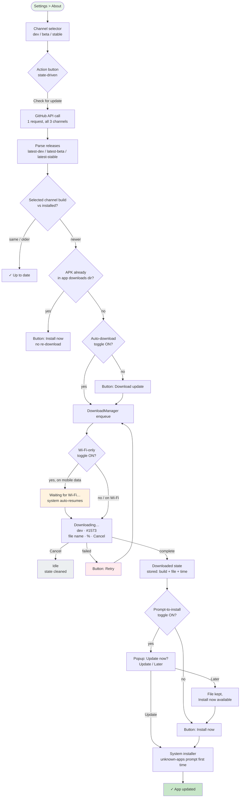
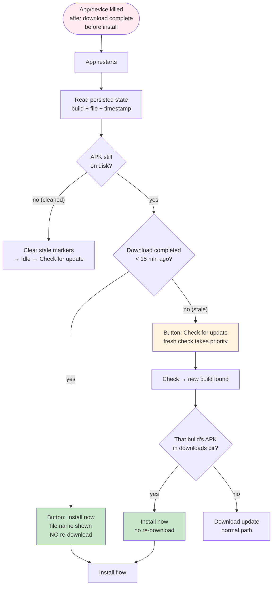

# Channel Auto-Update — Flow & State Machine

> Last Updated: 2026-08-13

## 1. Main update flow

## 2. Restart / staleness handling (15-min rule)

## 3. Channel mapping

| Branch | Channel | Cadence | Tag | Prerelease |
|--------|---------|---------|-----|-----------|
| `feature/*` | dev | 10+/day | `latest-dev` | yes |
| `dev` | beta | 2/week | `latest-beta` | yes |
| `main` | stable | 2/month | `latest-stable` | no |

Rolling releases: one release per channel, always the newest. Old releases are deleted on publish.

## 4. Toggles (all persisted in app_settings)

- **Auto-download updates** — after check, download automatically
- **Prompt to install after download** — popup when download completes
- **Download only on Wi-Fi** — DownloadManager `setAllowedOverMetered(false)`; system pauses/resumes
- **Check for updates after unlock** — app-start check, fires post-DB-unlock

## 5. Key behaviors

- Download destination: app-private dir (`Android/data/<pkg>/files/downloads/`) — no storage permission on any API level
- Completed downloads persisted (build, file, timestamp) → restart offers Install instead of re-downloading
- Fresh window: 15 min; stale → re-check first, folder re-scan
- Cancel: removes partial file + persisted state; toggle-off also cancels in-flight
- Single state-driven button: Check → Download → Install now / Retry — one action at a time
- All taps, toggles, transitions, and startup-check decisions traced; no user content in logs
